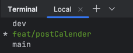
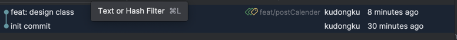
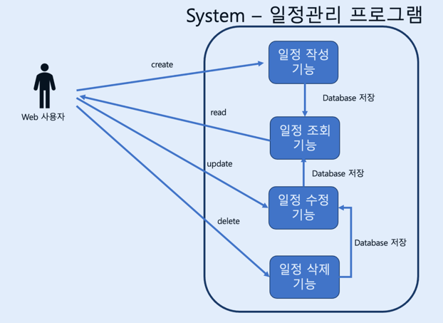
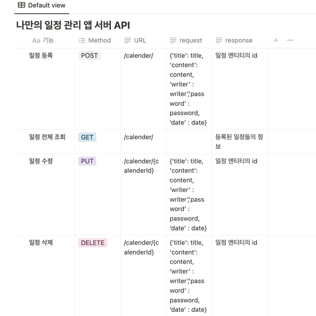

# 나만의 일정관리 앱 서버
---

## 진행과정
1. spring boot 프로젝트 생성
   1. lombok, spring web, thymeleaf 의존성 주입
2. 클래스 설계
   1. controller, service, repository 객체 생성
   2. dto, entity 객체 생성
3. feat/기능명 브랜치 생성
4. 기능 구현
5. pull request, merge, pull origin main

# Goal

---

## 1. 깃 워크 플로우 구현하기

1. main 은 배포용, dev 은 배포전 메인, feat/기능 브랜치는 기능 단위로 브랜치 만들기
   - 
2. 메소드 단위로 커밋하고, 커밋 메세지는 커밋 컨벤션에 맞추어서
    - 
## 2. 설계

1. Use Case Diagram 작성하기

2. API 명세서 작성하기

3. ERD 작성하기

## 3. 스프링부트 기반 기능 구현하기

1. 스프링부트 기반 프로그램 구현
2. CRUD 기능 구현
3. REST API 기능 구현

# Reference

---

## **Use Case Diagram 그려보기!**

- Use Case Diagram이란 서비스(System)와 사용자(Actor)간의 상호작용을 다이어그램으로 표현한 것입니다.
- 사용자 관점에서 개발하려는 서비스의 기능 및 요소들을 한눈에 확인할 수 있다는 장점이 있습니다.
- 개발에 들어가기에 앞서 먼저 아래 요구사항을 토대로 Use Case Diagram을 그려보면서 서비스의 전체적인 흐름을 확인해보세요!

> Use Case Diagram 추천 무료 Tool
>
>
> [Flowchart Maker & Online Diagram Software](https://app.diagrams.net/)
>

> Use Case Diagram Tutorial With Examples
>
>
> [UML - Use Case Diagram - Tutorial With Examples](https://www.softwaretestinghelp.com/use-case-diagram-tutorial/)
>

## **API 명세서 작성하기!**

- API 명세서란 API명, 요청 값(파라미터), 반환 값, 인증/인가 방식, 데이터 및 전달 형식 등 API를 정확하게 호출하고 그 결과를 명확하게 해석하는데 필요한 정보들을 일관된 형식으로 기술한 것을 의미합니다.

> API 명세서 추천 무료 Tool
>
>
> [Document your APIs in Postman | Postman Learning Center](https://learning.postman.com/docs/publishing-your-api/api-documentation-overview/)
>

## **API 명세서 작성하기!**

- API 명세서란 API명, 요청 값(파라미터), 반환 값, 인증/인가 방식, 데이터 및 전달 형식 등 API를 정확하게 호출하고 그 결과를 명확하게 해석하는데 필요한 정보들을 일관된 형식으로 기술한 것을 의미합니다.

[예) [서점] 책 API 설계하기](https://www.notion.so/c3a9e305a9174e319e7fc229aed6d602?pvs=21)

> API 명세서 추천 무료 Tool
>
>
> [Document your APIs in Postman | Postman Learning Center](https://learning.postman.com/docs/publishing-your-api/api-documentation-overview/)
>

## **ERD 작성하기!**

> https://online.visual-paradigm.com/ko/community/share/er-diagram-for-online-book-store-1gnrscfbme

- Use Case Diagram과 API 명세 작성을 통해 서비스의 큰 흐름과 기능을 파악 하셨다면 이제는 기능을 구현하기 위해 필요한 데이터가 무엇인지 생각해봐야합니다.
    - 이때, 구현해야 할 서비스의 영역별로 필요한 데이터를 설계하고 각 영역간의 관계를 표현하는 방법이 있는데 이를 ERD라 부릅니다.
- E(Entity. 개체)
    - 구현 할 서비스의 영역에서 필요로 하는 데이터를 담을 개체를 의미합니다.
        - ex) `책`, `저자`, `독자`, `리뷰`
- A(Attribute. 속성)
    - 각 개체가 가지는 속성을 의미합니다.
        - ex) 책은 `제목`, `언어`, `출판일`, `저자`, `가격` 등의 속성을 가질 수 있습니다.
- R(Relationship. 관계)
    - 개체들 사이의 관계를 정의합니다.
        - ex) `저자`는 여러 권의 `책`을 집필할 수 있습니다. 이때, 저자와 책의 관계는 일대다(1:N) 관계입니다.

> ERD 추천 무료 Tool
>
>
> [ERDCloud](https://www.erdcloud.com/)
>

> ERD 추천 영상
>
>
> https://www.youtube.com/watch?v=jsOPr3QfMW0
>

## **API 테스트 하기!**

- 과제를 진행 하시면서 여러분들이 개발한 API가 요구사항에 맞게 동작 하는지 확인하려면 API가 반환하는 반환(결과) 값을 계속해서 확인하셔야 합니다.
- 이때, 더 쉽게 확인 하실 수 있는 도구가 있는데 바로 Postman 입니다. 사용법은 아래 페이지에서 꼭 확인해주세요!

[Postman사용법](https://www.notion.so/Postman-391b29f89f034ac9adae30dcefe81b4e?pvs=21)

## **참고!**

- **Java의 Optional**
    - Optional의 탄생 배경을 이해하려면 먼저 null이란 무엇인지 이해해야합니다.
        - null이란? 유요한 객체를 참조하지 않고 있음을 가리키기 위해 저장된 값을 의미합니다.
    - 그런데 이 null을 만든 Tony Hoare는 null 참조를 만든 것은 10억 달러의 실수라고 말했습니다.

      > I call it my billion-dollar mistake…At that time, I was designing the first comprehensive type system for references in an object-oriented language. My goal was to ensure that all use of references should be absolutely safe, with checking performed automatically by the compiler. But I couldn’t resist the temptation to put in a null reference, simply because it was so easy to implement. This has led to innumerable errors, vulnerabilities, and system crashes, which have probably caused a billion dollars of pain and damage in the last forty years.
      >
      >
      > – Tony Hoare, inventor of ALGOL W.
    
    - 왜? null을 10억 달러의 실수라고 말했을까요?

      [왜 Null이 나쁜가?  | Mimul Tech log](https://www.mimul.com/blog/why-null-is-bad/)

    - Optional은 10억 달러의 실수인 Java의 null을 Safety(하게) 사용할 수 있도록 도와줍니다.

      [Guide To Java 8 Optional | Baeldung](https://www.baeldung.com/java-optional)

- **ResponseEntity**
    - ResponseEntity는 Spring Framework에서 제공하는 클래스 중 하나로 HTTP 요청(Request) 또는 응답(Response)에 해당하는 HttpHeader와 HttpBody를 포함하고 있는 클래스입니다.
    - HTTP 요청에 대한 응답을 처리할 때 해당 클래스를 사용하면 유연하고 편리하게 처리할 수 있습니다.

  [ResponseEntity (Spring Framework 6.0.12 API)](https://docs.spring.io/spring-framework/docs/current/javadoc-api/org/springframework/http/ResponseEntity.html)

  [Spring ResponseEntity - Using ResponseEntity in Spring Application](https://www.javaguides.net/2019/08/spring-responseentity-using-responseentity-in-spring-application.html)

  [Example usage for org.springframework.http ResponseEntity ok](http://www.java2s.com/example/java-api/org/springframework/http/responseentity/ok-1-0.html)

## **주의사항!**

- Entity를 그대로 반환하지 말고, DTO에 담아서 반환해주세요!
    - 최근에는 프론트엔드와 백엔드가 느슨하게 결합하는 환경이 더 일반적입니다.
    - 따라서 앞으로 남은 강의 예제와 실습에서는 html/css/js, 즉 View 도 같이 반환 하겠지만 과제에서는 여러분들이 서버 로직에 더 집중하실 수 있도록 JSON을 반환하는 API 형태로 진행하려고 합니다.

[왜? 우리는 DTO를 사용해야할까?](https://www.notion.so/DTO-4c3ec1c63b744c6faee222b81dc121d9?pvs=21)

# 기능 요구 사항

---

## 필수 구현 기능

- [ ]  일정 작성 기능
    - `할일 제목`,`할일 내용`, `담당자`, `비밀번호`, `작성일`을 저장할 수 있습니다.
    - 저장된 게시글의 정보를 반환 받아 확인할 수 있습니다.
        - 반환 받은 게시글의 정보에 `비밀번호`는 제외 되어있습니다.
- [ ]  선택한 일정 조회 기능
    - 선택한 일정의 정보를 조회할 수 있습니다.
        - 반환 받은 일정 정보에 `비밀번호`는 제외 되어있습니다.
- [ ]  일정 목록 조회 기능
    - 등록된 일정 전체를 조회할 수 있습니다.
        - 반환 받은 일정 정보에 `비밀번호`는 제외 되어있습니다.
    - 조회된 일정 목록은 `작성일` 기준 내림차순으로 정렬 되어있습니다.
- [ ]  선택한 일정 수정 기능
    - 선택한 일정의 `할일 제목`,`할일 내용`, `담당자`을 수정할 수 있습니다.
        - 서버에 일정 수정을 요청할 때 `비밀번호`를 함께 전달합니다.
        - 선택한 일정의 `비밀번호`와 요청할 때 함께 보낸 `비밀번호`가 일치할 경우에만 수정이 가능합니다.
    - 수정된 일정의 정보를 반환 받아 확인할 수 있습니다.
        - 반환 받은 일정의 정보에 `비밀번호`는 제외 되어있습니다.
- [ ]  선택한 일정 삭제 기능
    - 선택한 일정을 삭제할 수 있습니다.
        - 서버에 일정 삭제를 요청할 때 `비밀번호`를 함께 전달합니다.
        - 선택한 일정의 `비밀번호`와 요청할 때 함께 보낸 `비밀번호`가 일치할 경우에만 삭제가 가능합니다.

## 추가 구현 기능

- [ ]  선택한 일정 수정 및 삭제 요청 시 `비밀번호`가 일치하지 않을 경우 API 요청 실패(예외상황)에 대해 판단할 수 있는 Status Code, Error 메시지등의 정보를 반환합니다.

  [HTTP 상태 코드 - HTTP | MDN](https://developer.mozilla.org/ko/docs/Web/HTTP/Status)

# 추가요구사항

---

<aside>
❓ **Why: 과제 제출시에는 아래 질문을 고민해보고 답변을 함께 제출해주세요.**

</aside>

1. 수정, 삭제 API의 request를 어떤 방식으로 사용 하셨나요? (param, query, body)
2. RESTful한 API를 설계하셨나요? 어떤 부분이 그런가요? 어떤 부분이 그렇지 않나요?
3. 적절한 관심사 분리를 적용하셨나요? (Controller, Service, Repository)
4. API 명세서 작성 가이드라인을 검색하여 직접 작성한 API 명세서와 비교해보세요!

<aside>
⚠️ **Warning : 꼭 지켜야 할 것과 하지 않아도 되는 것!**

</aside>

- 이것은 꼭 지켜주세요(Do's)
    - 작성하신 Use Case Diagram, API 명세서, ERD를 제출해주세요!
    - 과제의 Github 링크를 꼭 제출해주세요!
    - 과제의 필수 요구 사항(기능)은 모두 지켜주세요. 특정 기능을 임의로 배제하시면 안 됩니다!
- 이것은 하지 않으셔도 돼요(Don'ts)
    - 과제 추가 기획 때문에 고민하지 마세요. 위에 작성된 과제 필수 요구 사항(기능)만 지키면 됩니다!

      → 좋은 예 (⭕ ): "아하, 결국 Spring Boot로 기본 CRUD 가 가능한 서비스를 만들면 되는거구나!"

      → 나쁜 예 (❌ ): "로그인 없어도 되나? 다른 기능이 더 있어야 하지 않을까?"

<aside>
⚙ **개발 습관 들이기**

</aside>